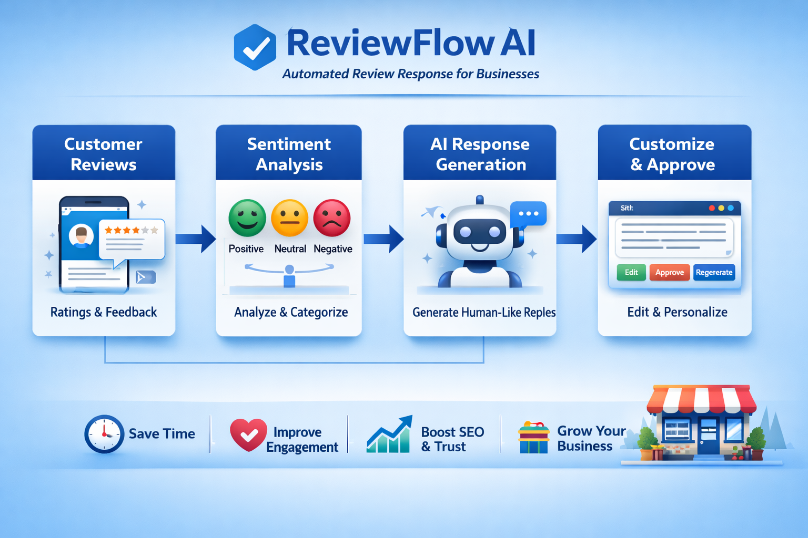

# 🚀 ReviewFlow AI

AI-powered review response automation for businesses.

👉 Turn customer feedback into engagement instantly.

---

## 🌐 Live Demo

https://reviewflowapp.vercel.app  
Login: https://reviewflowapp.vercel.app/login

---

## 🎯 Problem

Businesses often fail to respond to customer reviews consistently, which leads to:

- Poor brand perception  
- Reduced customer trust  
- Lower local SEO rankings  

---

## 💡 Solution

ReviewFlow AI helps businesses:

- Analyze customer reviews using sentiment analysis  
- Generate human-like AI responses instantly  
- Customize tone (friendly, professional, apologetic)  
- Approve, edit, or regenerate responses  
- Improve communication efficiency  

---
## 🔄 System Workflow




## ✨ Features

- 🔐 User Authentication  
- 📊 Review Dashboard  
- 🧠 Sentiment Analysis (Positive / Neutral / Negative)  
- 🤖 AI Response Generation (Tone-based)  
- ✏️ Edit / Approve / Regenerate responses  
- 📈 Basic Analytics  

---

## 🛠 Tech Stack

- Frontend: Next.js + Tailwind CSS  
- State Management: React Context API  
- AI: OpenAI API  
- Deployment: Vercel  

## 🎨 Use Cases

- Restaurants 🍽️  
- Clinics 🏥  
- Salons 💇  
- Small businesses  

---

## 🔮 Future Improvements

- Google Reviews API integration  
- Auto-publish responses  
- Multi-language support  
- Database integration (Supabase/Firebase)  

---

## ⚙️ Setup Instructions

### 1. Clone the repository

```bash
git clone https://github.com/ganeshpydipelli-gif/review-response-automation.git
cd review-response-automation
